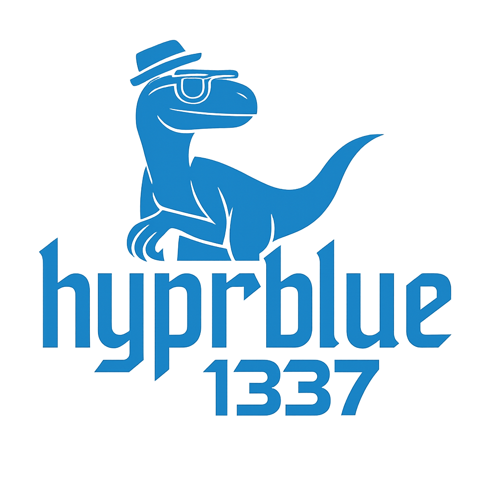

# Hyprblue

An unopinionated Universal Blue image of Bluefin DX that includes the Hyprland and friends packages, such as the various hypr* packages, waybar, walker, and various other related sundries.

It maintains the normal Bluefin GNOME desktop as the default, but Hyprland (with completely stock config) is available as a session in GDM.

It is suitable for deploying directly yourself onto your own machine as a platform for doing your own custom hyprland setup on top of a Bluefin base, or for basing new images on with opinionated hyprland desktop setups.

